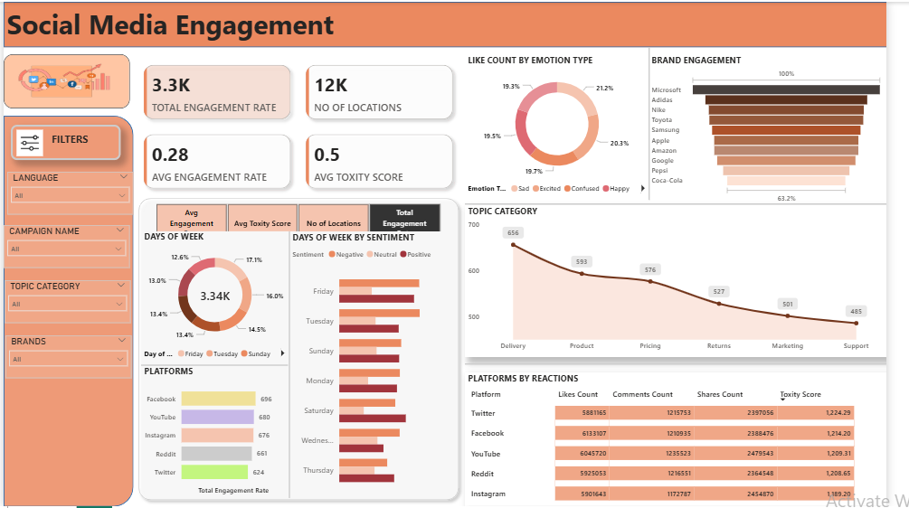

# social-media-engagement-dashboard
A Power BI dashboard analyzing social media engagement data using DAX, charts, and sentiment analysis.
````
📊 Social Media Engagement Dashboard - Power BI Project



🔍 Project Overview

This Power BI dashboard provides insights into social media engagement patterns across various platforms, brands, topics, emotions, and days of the week. The dataset was sourced from Kaggle and modified for better analysis. The dashboard helps in identifying which platforms and brands have the highest engagement, the sentiment of users, and the toxicity levels in interactions.

📁 Dataset

- Source: [Kaggle - Social Media Engagement Dataset](https://www.kaggle.com/)
- The dataset was cleaned and modified using **Microsoft Excel** before being imported into Power BI.
- Sample columns:
  - `Day of Week`, `Platform`, `Location`, `Language`, `Hashtags`
  - `Topic Category`, `Sentiment Label`, `Emotion Type`, `Toxity Score`
  - `Likes Count`, `Shares Count`, `Comments Count`, `Engagement Rate`
  - `Brand Name`, `Campaign Name`, `Campaign Phase`

🛠️ Measures Created (DAX)

```DAX
Total Engagement Rate = SUM([Engagement Rate])
AVG Engagement Rate = AVERAGE([Engagement Rate])
No of Locations = COUNTROWS('Social Media Engagement')
AVG Toxity Score = AVERAGE([Toxity Score])
````

**A dynamic parameter table was created to switch between these four KPIs:**

```DAX
Parameter = {
    ("Avg Engagement Rate", NAMEOF('Social Media Engagement'[Avg Engagement Rate]), 0),
    ("Avg Toxity Score", NAMEOF('Social Media Engagement'[Avg Toxity Score]), 1),
    ("No of Locations", NAMEOF('Social Media Engagement'[No of Locations]), 2),
    ("Total Engagement Rate", NAMEOF('Social Media Engagement'[Total Engagement Rate]), 3)
}
```

## 📈 Visualizations

* **Donut Chart**: Days of Week – by KPI
* **Stacked Bar Chart**: Platforms vs selected KPI
* **Clustered Bar Chart**: Days of Week by Sentiment
* **Donut Chart**: Like Count by Emotion Type
* **Funnel Chart**: Brand Engagement
* **Line Chart**: Topic Category vs Total Engagement
* **Matrix Table**: Platform by Reactions (likes, comments, shares, toxicity)

## 🔎 Filters/Slicers

* Language
* Campaign Name
* Topic Category
* Brands

##v 🔗 Dataset Reference

The dashboard includes a clickable image linked to the dataset's original source on Kaggle. Hold `Ctrl + Click` in Power BI to open the dataset URL.

## 📌 How to Use This Project

**1. Clone the repo:**

   git remote add origin https://github.com/SahGobind/-Social-Media-Engagement.git

2. Open the `.pbix` file in **Power BI Desktop**
3. Explore the measures, parameter slicer, and visualizations
4. Optional: Replace the dataset with your own updated version


## 👩‍💻 Created by

  Gobind Prasad Sah

📍 Data Analyst Intern  